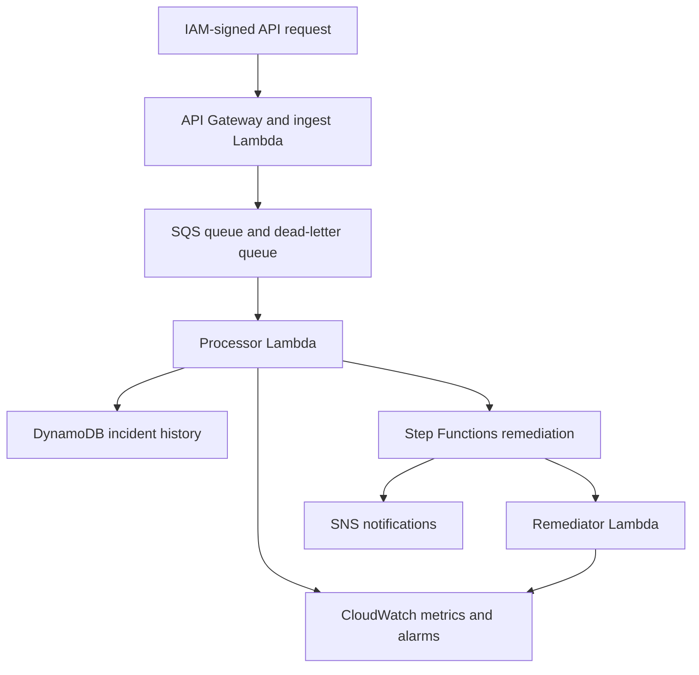

# RegionGuard AWS Reliability Platform

RegionGuard is a serverless AWS project that accepts service-health events, processes them asynchronously, stores incident history, emits operational metrics, and runs a simulated remediation workflow when a service becomes unhealthy.

The project demonstrates cloud-native architecture, event-driven processing, reliability engineering, observability, least-privilege permissions, infrastructure as code, automated testing, and CI/CD. It is designed as a portfolio project for an early-career software development engineer role focused on regional reliability operations.

## Architecture



### AWS services

- API Gateway exposes IAM-protected health and incident endpoints.
- Lambda validates requests, processes SQS records, and simulates recovery actions.
- SQS buffers events and moves messages to a dead-letter queue after three failed attempts.
- DynamoDB stores health events and incident status with a 30-day time to live.
- Step Functions orchestrates delayed recovery and routes success or failure notifications.
- CloudWatch stores metrics, logs, alarms, traces, and an operations dashboard.
- SNS publishes unhealthy-service alarms and remediation results.
- X-Ray tracing is enabled for Lambda and Step Functions.
- AWS CDK defines the entire environment as Python code.
- GitHub Actions runs linting, tests, and `cdk synth` on every change.

## Reliability behavior

- Conditional DynamoDB writes and deterministic workflow IDs make retries idempotent.
- SQS partial-batch responses retry only failed records.
- A dead-letter queue isolates poison messages after three attempts.
- CloudWatch alarms notify operators about unhealthy services and DLQ messages.
- The remediation workflow records recovery status and recovery time.
- Queue encryption, table encryption, SNS encryption, IAM authorization, and least-privilege policies protect the workload.

The remediation action is intentionally simulated. The project does not control production services and does not represent an actual air-gapped environment.

## Project structure

```text
regionguard-aws-reliability/
├── app.py
├── regionguard/regionguard_stack.py
├── lambda_src/
│   ├── common.py
│   ├── ingest/app.py
│   ├── processor/app.py
│   ├── remediator/app.py
│   └── status/app.py
├── scripts/
│   ├── aws_signed_request.py
│   ├── send_health_event.py
│   └── list_incidents.py
├── tests/
├── .github/workflows/ci.yml
├── requirements.txt
└── package.json
```

## Prerequisites

- Python 3.12
- Node.js 20 or newer
- An AWS account
- AWS CLI credentials configured locally
- Permission to deploy CloudFormation, Lambda, API Gateway, SQS, DynamoDB, Step Functions, CloudWatch, SNS, IAM, KMS, and X-Ray resources

Confirm your AWS identity before deploying:

```bash
aws sts get-caller-identity
```

## Install

```bash
python3 -m venv .venv
source .venv/bin/activate
pip install -r requirements-dev.txt
npm install
```

## Test locally

```bash
ruff check .
pytest -q
npx cdk synth
```

## Deploy

Bootstrap CDK once per AWS account and Region:

```bash
npx cdk bootstrap
```

Deploy the stack. Supplying an email address is optional. AWS sends a confirmation email before that address receives SNS notifications.

```bash
npx cdk deploy -c notificationEmail=you@example.com
```

Copy the `ApiUrl` value printed by CDK. The endpoints require AWS Signature Version 4 credentials. The included scripts sign requests with the credentials from your active AWS profile.

## Run the demo

Set the deployed API URL:

```bash
export REGIONGUARD_API_URL="https://example.execute-api.us-east-1.amazonaws.com/prod/"
```

Send a healthy event:

```bash
python scripts/send_health_event.py \
  --api-url "$REGIONGUARD_API_URL" \
  --status HEALTHY \
  --latency-ms 85
```

Trigger a successful remediation workflow:

```bash
python scripts/send_health_event.py \
  --api-url "$REGIONGUARD_API_URL" \
  --status UNHEALTHY \
  --latency-ms 2500
```

Trigger the manual-intervention path:

```bash
python scripts/send_health_event.py \
  --api-url "$REGIONGUARD_API_URL" \
  --status UNHEALTHY \
  --latency-ms 2500 \
  --fail-recovery
```

List incidents:

```bash
python scripts/list_incidents.py --api-url "$REGIONGUARD_API_URL"
```

Filter incident history by service and Region:

```bash
python scripts/list_incidents.py \
  --api-url "$REGIONGUARD_API_URL" \
  --service-id payments-api \
  --service-region us-east-1
```

## Demonstrate idempotency

Send the same UUID twice. The processor stores and acts on it once.

```bash
EVENT_ID="11111111-1111-4111-8111-111111111111"

python scripts/send_health_event.py \
  --api-url "$REGIONGUARD_API_URL" \
  --status UNHEALTHY \
  --event-id "$EVENT_ID"

python scripts/send_health_event.py \
  --api-url "$REGIONGUARD_API_URL" \
  --status UNHEALTHY \
  --event-id "$EVENT_ID"
```

The second event is logged as `duplicate_event_skipped`. It reuses the deterministic workflow ID, so Step Functions does not create a second remediation execution. Retrying workflow startup also prevents an incident from being lost if the database write succeeds before a temporary Step Functions failure.

## Demonstrate the dead-letter queue

Copy the `HealthEventsQueueUrl` output and send an invalid message directly to SQS:

```bash
aws sqs send-message \
  --queue-url "YOUR_HEALTH_EVENTS_QUEUE_URL" \
  --message-body 'not-json'
```

After three processing attempts, SQS moves the message to the DLQ and the DLQ CloudWatch alarm enters the alarm state.

## Observability

Open the `RegionGuard-Operations` CloudWatch dashboard after running the demo. It displays:

- Healthy, degraded, and unhealthy event counts
- Average recovery time
- Main queue and dead-letter queue depth
- Lambda errors

Use CloudWatch Logs Insights to search the Lambda log groups for `duplicate_event_skipped` or `record_processing_failed`. X-Ray traces show the request path through the serverless components.

## Resume bullets after deployment and testing

Use these only after you have deployed, tested, and can explain the implementation:

- Built an event-driven AWS reliability platform using Python, Lambda, API Gateway, SQS, DynamoDB, Step Functions, CloudWatch, and SNS to monitor service health and automate incident response.
- Implemented idempotent processing, partial-batch retries, dead-letter queues, alarms, distributed tracing, and recovery workflows to handle duplicate events and simulated service failures.
- Provisioned AWS infrastructure with CDK and added GitHub Actions CI for linting, automated tests, and CloudFormation synthesis using least-privilege IAM permissions.

Replace generic claims with measurements from your own test runs, such as events processed per minute, test coverage, and median recovery time.

## Cleanup

This project creates billable AWS resources. Review current AWS pricing, configure a billing alarm, and remove the stack when you finish testing:

```bash
npx cdk destroy
```

The DynamoDB table and CloudWatch log group use a destroy policy because this is a demonstration project. Do not use that deletion policy for production incident records.
